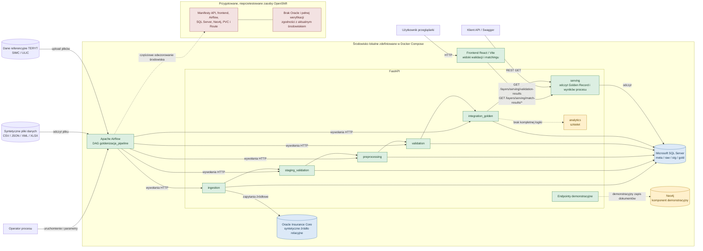

# D-01. Architektura komponentów

## Legenda

- Zielony: komponent używany i zweryfikowany w środowisku lokalnym.
- Niebieski: baza danych uczestnicząca w potwierdzonym przepływie.
- Żółty: komponent częściowy albo demonstracyjny.
- Czerwony: zasoby przygotowane, ale niezweryfikowane na docelowym środowisku.

## Uwagi

1. Neo4j nie uczestniczy w głównym procesie goldenizacji.
2. Warstwa `serving` udostępnia dane wynikowe przez REST, natomiast `analytics` pozostaje szkieletem.
3. Manifesty OpenShift nie zostały przetestowane i nie obejmują Oracle.
4. Airflow komunikuje się z FastAPI przez HTTP, a nie przez bezpośredni dostęp do SQL Servera.
